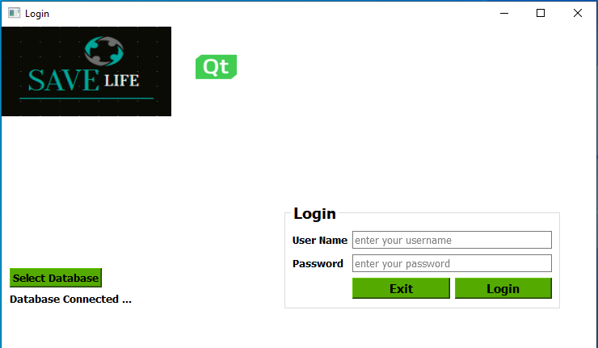

# Save-Life-Cross-Platform-Application-C-plus- plus
<h2>Qt Creator IDE and Essential Qt modules, C++ programming language, SQL with OOP design patterns. </h2>

The principal and practice of medical professionals in the Medicine and healthcare industry, to confirm medical problems and diagnosis when considering patient sing and symptoms, patient medical history and vital signs kind of blood pressure, breathing, Pulse and temperature with investigation tests and procedures. Many types of equipment are available for the vital sign as Pulse oximeter (monitor the oxygen saturation patient’s blood) sphygmomanometer (blood pressure) ECG measurement system only for monitor purposes.  Usually, medical professionals must analyze diagnostic investigation reports as full blood, Diagnostic imaging reports several kinds of scan reports, etc....  Sri Lanka has faced a lack of efficiency issues because there is no proper link in medical laboratories and Doctors or medical expertise with analytics medical problems and diagnosis from diagnostic investigation reports. It will be affected by health experts to make their final investigation for patients who need emergency treatment as priority wise. To solve this issue should have smart detecting and data manipulating system to catch those areas via diagnostic investigation reports.

This Software Application will be able to create and update medical investigation Documents, View Scan images and patients’ diagnostic investigation data manipulation and able to link medical professionals, medical laboratories and hospital Staff. also, it will visualize Abnormal, Normal and Critical patient details, Emergency Scans request from medical laboratories and Full details of relevant hospital ward. It will be affected by health experts to make their final diagnosis investigation for patients who need emergency treatment as priority wise from the hospital. This will be a more efficient method to make very sensitive medical investigations, diagnosis and decision making immediately. Also, this system will help Medical scientists to study the behavior of the human body of several illness and find new ways to cure or treat disease by developing advanced diagnostic tools or new therapeutic strategies.

  
 <h2>Program Description </h2>

<b>SAVE LIFE</b> is a Decision Support Software Application developed by using Qt Creator IDE and Essential Qt modules and C++ programing language with OOP design patterns. This Application has developed to achieving Plymouth university cross-platform application development module assignment requirement. This desktop software application can run windows and Linux operating systems.
<b>SAVE LIFE</b> has three Main User interfaces,
<ul>
  <li>Healthcare Staff user interface. </li>
  <li>The doctor or Medical Expertise user interface.</li>
  <li>Laboratory user interface.</li>
</ul>

These three medical professionals allow to register with SAVE LIFE and they can effectively use user interfaces to improve their decision making & sickness collaboration.

<h2>Scope and Functionality</h2> 

This system will be introduced for Doctors, medical expertise, Medical laboratory scientist and healthcare staff, in the Medicine and healthcare industry, to improve their medical investigations, diagnosis, decision making, and sickness collaboration. It provides the means for efficient diagnostic investigation, reporting, a thorough analysis of data

the initial program functionality was as follows:

  
<ul>
  <li>Doctors or medical expertise Login.</li>
  <li>Medical Laboratory scientist Login. </li>
  <li>Healthcare staff logging Login.</li>
  <li>without the database connection, users can create a new document, save, etc. and use image viewer application.</li>
  <li>Healthcare staff able to add, remove, update Patient’s Database Records.</li>
  <li>All users allowed to create an investigation document, open a document, save the documents and update the documents to the database or computer.</li>
  <li>The text-editing program enables doctors to change reports' font size, font color, highlight text, copy, paste, undo and redo.</li>
  <li>image viewer application enables the laboratory to open scan images from the computer.</li>
  <li>All users allowed to view the selected patient's details.</li>
  <li>Doctors or medical expertise can update the patient investigation details.</li>
  <li>Also, Doctors or medical expertise may able to Request Scans from the immediate process or Normal process from the laboratory and they can view Abnormal, critical or Normal scan results Details and scan results Summary reports.</li>
  <li>Ability to visualize patient's abnormal, normal or critical investigation summary reports.</li>
  <li>Medical Laboratory scientists allowed to create scan result report documents, open a document, save the documents and update documents to the database or PC.</li>
  <li>Medical Laboratory scientists can open selected scan images stored on the computer.</li>
  <li>Ability to visualize abnormal, normal or critical scan results summary reports.</li>
  <li>Based on updated details that experts can attend scan or required actions immediately.</li>
  <li>Ability to visualize the medical history of the patient.</li>
 
</ul>  
 
<h3>Supported Platforms </h3>

Currently, SAVE LIFE has been tested and verified to run on both Windows 10 and Fedora Linux distribution. Below are screenshots of Software application run on Windows OS and Fedora Linux distribution.

<h2>Description of the GUI design</h2>

Connect With Database

  

  

  
  

  

  
      

<h3>Login GUI</h3>

When starting the program, you will be presented with Login UI (QMainWindow) and Following Widgets Login User interface built from the following widgets. 

 <ul>
 <li>Save Life Logo – QLabel</li>
 <li>Qt Logo- QLabel</li>
 <li>Group box-QGroupBox</li>
 <li>Select Database Button – QPushButton – Select to (savelifedb) database</li>
 <li>Login button- QPushButton -Login SAVE LIFE Application</li>
 <li>Exit button- QPushButton - Exit SAVE LIFE Application</li>
 <li>Message Box – QMessageBox- Information, Warning, a critical predefined message.</li>

</ul>

Start Page

  
<h3>Healthcare Staff GUI</h3>

When login the program, you will be presented with Healthcare Staff UI (QDialog) with Following Widgets 

User interface built from the following widgets. 

  <ul>
<li>Group box- QGroupBox – Register to Patient.</li>
<li>Group box- QGroupBox – Patient Details.</li>
<li>Patient ID Line Edit – QLineEdit- Enter Patient Identify Number.</li>
<li>Search Button - QPushButton – Retrieve Patient details from the database and display in Line Edit fields.</li>
<li>Admit Button- QPushButton -Enter the Patient's identity number, Name, Age, Address, Ward Number, bed Number, Guardian Details, description or Nurse's Notes then Click to Add the patient’s records to the database.</li>
<li>Update Button – QPushButton – Enter the Patient’s identity number into the Line Edit Patient identity number filed and Click to Update the selected patient’s records to the database.</li>
<li>Clear Button – QPushButton- Click to Clear All Line Edit field and Text Edit filed. </li>
<li>Discharge Button – QPushButton – Enter Patient identity number into the Line Edit Patient identity number filed then Click to Delete the selected patient’s records from the database. </li>
<li>New Button- QPushButton - Click to Create New Document.</li>
<li>Open Button- QPushButton – Click to Open Text Document file in PC.</li>
<li>Save Button- QPushButton – Click to Save Document file to your PC.</li>
<li>Save As Button- QPushButton - Click to make a copy of the file in a different folder or make a copy with a different name</li>
<li>Text Edit – QTextEdit -This basic text-editing program enables users to create a document, save a document and upload a document to the database.
<li>Scan Results Summary reports - Abnormal button -Critical button – Normal Button – QPushButton – Once you have clicked in the Scan Report label's forward Abnormal button you will display All patient's Abnormal Summary reports updated by the laboratory. If you have clicked the critical button you will display critical Scan Reading Summary Reports and if you have clicked the normal button you will display normal Scan Reading Summary Reports updated by the Laboratory.</li>
<li>Investigation Results Summary Reports - Abnormal button -Critical button – Normal Button – QpushButton – Once you have clicked in the Investigation Results label's forward Abnormal button you will display All patient's Abnormal Investigation Results Summary reports updated by the laboratory. if you have clicked the critical button you will display critical Investigation Results Summary Reports and if you have clicked the normal button you will display normal Investigation Results Summary Reports updated by the Laboratory.
<li>Message Box – QMessageBox- Information, Warning, a critical predefined message.</li>
<li>Login button- QPushButton -Login SAVE LIFE Application</li>
<li>Exit button- QPushButton - Exit SAVE LIFE Application</li>  
    
      

<h3>Doctor or Medical Expertise GUI</h3>

When login the program, you will be presented with Healthcare Staff UI (QDialog) with Following Widgets 

  

User interface built from following widgets 

  <ul>
<li>Patient ID Line Edit – QLineEdit- Enter Patient ID </li>
<li>Group box- QGroupBox - Update Diagnostic Investigate.</li>
<li>Group box- QGroupBox – Investigation Details.</li>
<li>Search Button - QPushButton - Retrieve the Patient’s details from the database and displayed in Line Edit fields.</li>
<li>New Button- QPushButton - Click to Create New Document.</li>
<li>Open Button- QPushButton – Click to Open Text Document file in PC.</li>
<li>Save Button- QPushButton – Click to Save Text Document file to your PC.</li>
<li>Save As Button- QPushButton - Click to make a copy of the file in a different folder or make a copy with a different name</li>
<li>Font Button- QPushButton- Click to Change the font size, Font Family of the Text Edit.</li>
<li>Font Color Button- QPushButton- Click to Change the font color of selected text.</li>
<li>Highlight Button- QPushButton- Click to Highlight of selected text.</li>
<li>Redo Button- QPushButton - Click to redo button in order to redo the Changes you have made in Text Edit.</li>
<li>Undo Button -QPushButton - Click to undo button in order to undo the changes you have made in Text Edit.</li>
<li>Paste Button -QPushButton – Click to takes what you've copied and restores</li>
<li>Copy Button -QPushButton - Click to Copy button in order to copy the text.</li>
<li>Text Edit – QTextEdit -This basic text-editing program enables users to create a document, Open Document save a document and upload a document to the database.</li>
<li>scan responses Combo box -QComboBox-Doctors or medical expertise may able to Request Scans from the immediate process or Normal process from the laboratory.</li>
<li>Investigation Summary Combo Box – QComboBox -Doctors or medical expertise allow updating patients investigation summary reports as abnormal normal or critical  </li>
<li>Clear Button – QPushButton- Click to Clear All Line Edit field and Text Edit filed. </li>
<li>Update Button – QpushButton – Enter the Patient’s identity number into the Line Edit Patient identity number filed and Click to Update the selected patient’s records to the database.</li>
<li>Scan Results Summary reports - Abnormal button -Critical button – Normal Button – QPushButton – Once you have clicked in the Scan Report label's forward Abnormal button you will display All patient's Abnormal Summary reports updated by the laboratory. If you have clicked the critical button you will display critical Scan Reading Summary Reports and if you have clicked the normal button you will display normal Scan Reading Summary Reports updated by the Laboratory.</li>
<li>Investigation Results Summary Reports - Abnormal button -Critical button – Normal Button – QPushButton – Once you have clicked in the Investigation Results label's forward Abnormal button you will display All patient's Abnormal Investigation Results Summary reports updated by the laboratory. if you have clicked the critical button you will display critical Investigation Results Summary Reports and if you have clicked the normal button you will display normal Investigation Results Summary Reports updated by the Laboratory.
<li>Message Box – QMessageBox- Information, Warning, a critical predefined message.</li>
<li>Login button- QPushButton -Login SAVE LIFE Application</li>
<li>Exit button- QPushButton - Exit SAVE LIFE Application</li>
</ul>

 
  
  
<h3>Laboratory GUI</h3>

When login the program, you will be presented with Laboratory UI (QDialog) with Following Widgets
 

User interface built from following widgets 

  <ul>
<li>Group box- QGroupBox – Register to Patient.</li>
<li>Group box- QGroupBox – View Scan.</li>
<li>Group box- QGroupBox – Scan Response.</li>
<li>Patient ID Line Edit – Enter Patient ID</li>
<li>Search Button - QPushButton - Retrieve the Patient’s details from the database and displayed in Line Edit fields.</li>
<li>New Button- QPushButton - Click to Create New Document.</li>
<li>Open Button- QPushButton – Click to Open Text Document file in PC.</li>
<li>Save Button- QPushButton – Click to Save Text Document file to your PC.</li>
<li>Save As Button- QPushButton - Click to make a copy of the file in a different folder or make a copy with a different name</li>
<li>Font Button- QPushButton- Click to Change the font size, Font Family of the Text Edit.</li>
<li>Font Color Button- QPushButton- Click to Change the font color of selected text.</li>
<li>Highlight Button- QPushButton- Click to Highlight of selected text.</li>
<li>Redo Button- QPushButton - Click to redo button in order to redo the Changes you have made in Text Edit.</li>
<li>Undo Button -QPushButton - Click to undo button in order to undo the changes you have made in Text Edit.</li>
<li>Paste Button -QPushButton – Click to takes what you've copied and restores.</li>
<li>Copy Button -QPushButton - Click to Copy button in order to copy the text.</li>
<li>Text Edit – QTextEdit -This basic text-editing program enables users to create a document, Open Document save a document and upload a document to the database.</li>
<li>Scan Summary Combo box -QComboBox- allows laboratories to update patients' investigation summary reports as abnormal normal or critical.</li>
<li>Clear Button – QPushButton- Click to Clear All Line Edit field and Text Edit filed. </li>
vUpdate Button – QPushButton – Enter the Patient’s identity number into the Line Edit Patient identity number filed and Click to Update the selected patient’s records to the database.</li>
<li>Requested Scans - Immediately button - Normal Button – QPushButton - Click the buttons to display Immediately requested scans or normally requested scans by the doctors.</li>
<li>Open Scan Button -QPushButton -Click to Open the scan images from your PC.</li>
<li>Message Box – QMessageBox- Information, Warning, a critical predefined message.</li>
<li>Login button- QPushButton -Login SAVE LIFE Application</li>
<li>Exit button- QPushButton - Exit SAVE LIFE Application.</li>
  </ul> 
 
  

  

